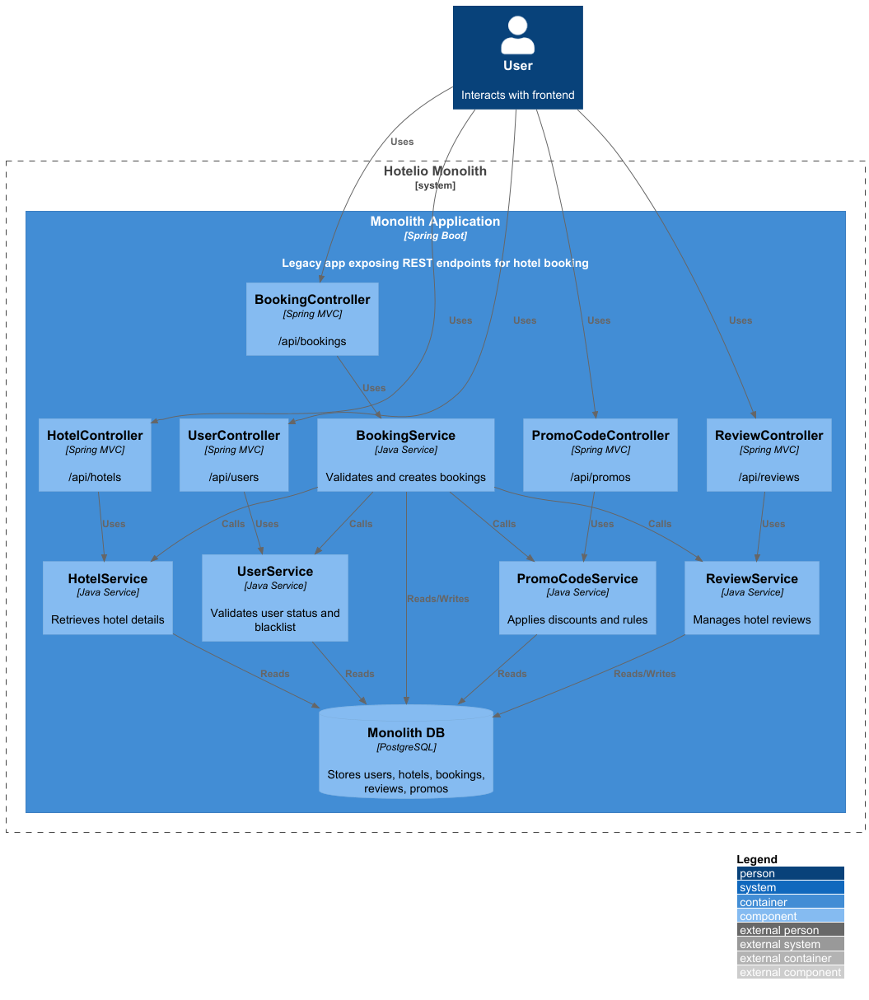
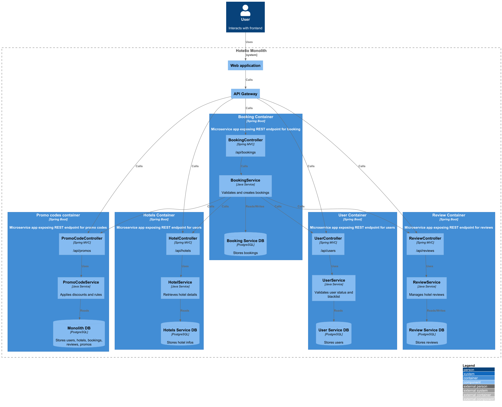
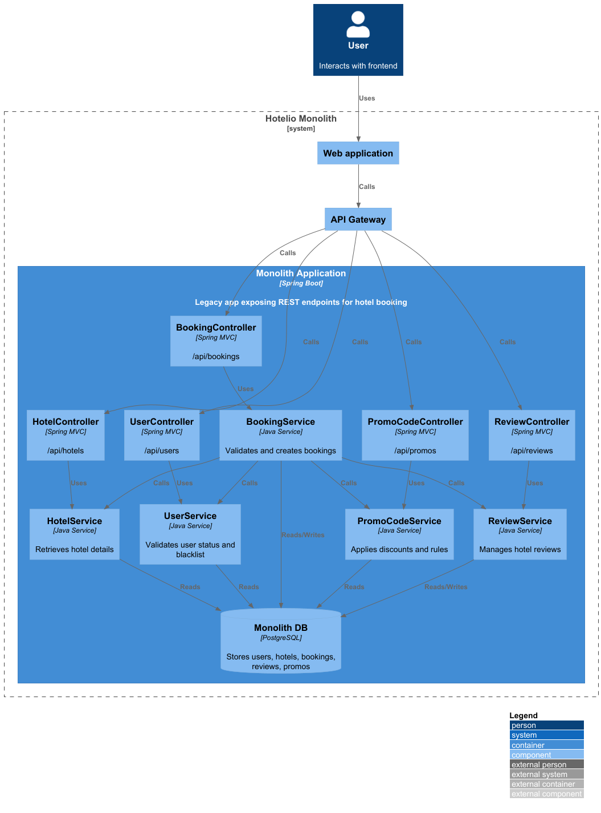
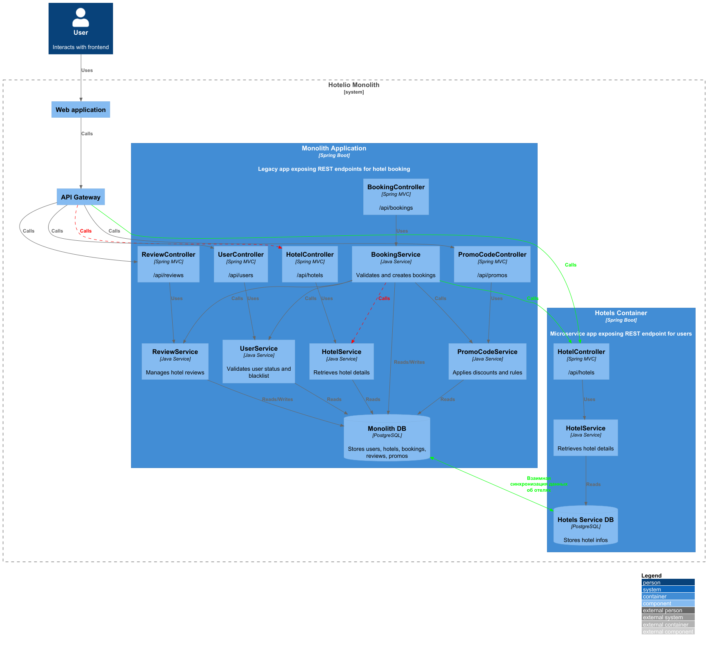
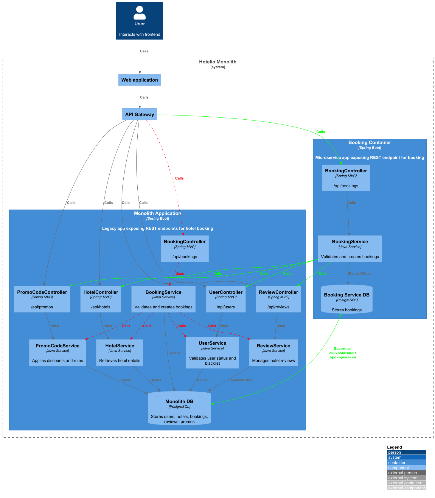

### **Планирование декомпозиции монолита Hotelio на микросервисы:** 
### **Автор: Иван Бабиков**
### **Дата: 11.08.26**

### Введение
В данный момент система Hotelio представляет собой монолитное приложение, обладающее свойственными монолитным приложениям недостатками:
- Сложности с масштабированием при росте нагрузки
- Сложности с синхронизацией работы разных команд для выпуска релизов
- Сильная связанность между поддоменами

Также обнаружено, что внутри монолита реализована сервис ориентированная архитектура, которая проявляется в том, что сервис бронирования синхронно вызывает все остальные сервисы. Это накладывает ограничения на варинты дизайна логики данной системы в микросервисной архитектуре.

### **Функциональные требования**

| **№** | **Действующие лица или системы**      | **Use Case**                                             | **Описание**                                                                                                                                                                                              |
|:-----:|:--------------------------------------|:---------------------------------------------------------|:----------------------------------------------------------------------------------------------------------------------------------------------------------------------------------------------------------|
|  F1   | Пользователь и клиенты внешних систем | Выбор отеля                                              | Пользователь ищет и просмотривает информацию об отелях. Помимо информации предоставляемой отелем, система предоставляет дополнительную информацию из своих данных (рейтинг, работает ли отель и т.п.) |
|  F2   | Пользователь и клиенты внешних систем | Бронирование отеля                                       | Система проверяет прользователя, отель, применяет промокодЮ расчитывает цену и создаёт бронирование (Прим. без окончательного согласования цены с пользователем. Так обычно не делается).                 |
F3|                                       | Получение данных через партнёрские каналы | Пользов                                                                                                                                                                                    |
### **Нефункциональные требования**
Опишите здесь нефункциональные требования и архитектурно значимые требования.

| **№** | **Требование**                                                                                                                                          |
|:-----:|:--------------------------------------------------------------------------------------------------------------------------------------------------------|
|  S1   | Возмжность масштабирование вынесенных в микросервисы модулей                                                                                            |
|  R1   | Миграция на миксровервисы не должна понижать отказоустойчивость всей системы                                                                            |
|  R2   | Миграция не должна приводить к нарушению целостности данных                                                                                             |
|  R3   | Миграция должна быть управляемой: нужно иметь возможность "на лету" дозировать трафик в новые сервисы и возможность полного отката на старый функционал |

### **Решение**

#### Исходная архитектура системы ####

На данной диаграмме видно, что система Hotelio это монолит, включающий пять модулей:

- UserService
- HotelService
- BookingService
- PromoCodeService
- ReviewService

При этом, видно, что **BookingService** вызывает все остальные. Это говорит о критической и главенствующей роли данного сервиса в системе. В сущности, то что мы видим на схеме, можно считать реализацией **cервис-ориентированной архитектуры** внутри монолита, когда вся система уже разбита на модули (архитектура **модульный монолит**, что уже не самый плохой вариант) и одни сервисы используют другие. 

В данном случае такой сервис, это **BookingService**.

Исходя из текущих **проблем роста монолита**, возникла классическая потребность **разбиения данного монолита на микросверисы**. После разбиения, предполагается следующая архитектура системы:

#### План разбиения монолита на микросервисы ####

Для плавного, или как пишут в ИТ-литературе *"seamless"*, разбиения на части предлагается использовать широкоизвестный паттерн разбиения монолита **Strangler Fig**. То есть будем *"есть слона по частям"*: шаг за шагом выносить из монолита наружу по одному сервису.

Но прежде, чем начать разбиение, нужно подготовить к нему систему, отделив её от прямых вызовов со стороны пользовательских сервисов через **"фасад"**, которым в архитектуре микросервисов может выступать **API Gateway**. Далее за данным "фасадом" мы сможем свободно менять архитектуру системы и перенаправлять трафик на новые компоненты.

**Архитектура системы после добавления API Gateway**

Для дальнейшего планирования нам нужно решить 2 задачи:

1. Выбор типа взаимодействия между сервисом бронирования и остальными сервисами (синхронное или ассинхронное).
2. Определение порядка выноса микросервисов.

##### 1.Выбор типа взаимодействия между сервисом бронирования и остальными сервисами (синхронное или ассинхронное). #####

Поскольку бронирование это быстрая конкурентная операция, её очень желательно реализовать **синхронно**, чтобы пользователь сразу получил положительный, либо отрицательный результат. Поэтому выбираем **синхронное** взаимодействие.

##### 2. Определение порядка выноса микросервисов. #####

Для определения порядка выноса модулей монолита в микросервисы предлагается рассмотреть следующие критерии:

1. Критичность для бизнеса.
2. Полезный эффект от выноса.
3. Удобство и быстрота выноса.
4. Минимальные риски при рефакторинге.
5. Скорость рефакторинга.

На основе каждого критерия дадим оценку полезности выноса каждого сервиса по пятибальной шкале.

**1. Критичность для бизнеса.**

Критичными для бизнеса являются 3 сервиса:

- **UserService** - **критически важен - 5 баллов**, так как **без регистрации** пользователь **не сможет** приступить к бронированию.
- **HotelService** - **критически важен - 5 баллов**, так как, **не просмотрев отели**, пользователь **не сможет** сделать выбор.
- **BookingService** - **критически важен - 5 баллов**, так как является **основной бизнес-функцией** сервиса.

Без остальных сервисов, с некоторыми недостатками система может работать:

- **PromoCodeService** - **не очень важен - 2 балла.** Забронировать можно и без промокодов, а скидку начислить позже.
- **ReviewService** - **не  очень важен - 2 балла.** Забронировать можно и без ревью, не все смотрят на ревью.

**2. Полезный эффект от выноса.**

- **UserService** - **не очень существенный - 3 балла.** Обычно пользователи регистрируются один раз, а затем сервис нужен только для проверки credentials.
- **HotelService** - **существенный - 4 балла.** Чтение данных отелей и поиск по ним создают существенную нагрузку на базу данных монолита.
- **BookingService** - **существенный - 4 балла.** Это основная бизнес-функция, но так, как она зависит от всех других функций, то вынос её с последюущим масштабированием принесёт эффект только в том случае, если все другие сервисы будут отрабатывать быстро.
- **PromoCodeService** - **минимальный - 1 балл.** Запрос промо-кода - это одна обычно один вызов для чтения данных на одно бронирование. Если промо-коды подтягиваются и при других операциях, то рейтинг данного пункта нужно повысить.
- **ReviewService** - **не существенный - 2 балла.** Часть пользователей не читают отзывы вообще. Отзывов много не пишут и кол-во отзывов априори меньше, чем бронирований. Чтение  и простановка рейтинга - разовая операция.

**3. Удобство и быстрота выноса.**

Быстрее всего выносить **"leaf"** части дерева зависимостей. Соотвтетственно **leaf-сервисы получают 5 баллов**, а **root** (сервис бронирования) - **1 балл**.

**4. Минимальные риски при рефакторинге.**

Минимальные риски при выносе **"leaf"** частей дерева зависимостей. Соотвтетственно **leaf-сервисы получают 5 баллов**, а **root** (сервис бронирования) - **1 балл**.

**5. Скорость рефакторинга.**

Проще и быстрее вынести **"leaf"** зависимость. После быстрого выноса первой зависимости, можно раньше получить результат и сделать выводы. Если в первую очередь вынести 4 **"leaf"** зависимости, то оставшийся в монолите сервис бронирования по сути автоматически станет микросервисом, который уже можно будет масштабировать. Соотвтетственно **leaf-сервисы получают 5 баллов**, а **root** (сервис бронирования) - **1 балл**.

Соберём все оценки в таблицу и расставим порядок выноса модулей в микросервисы в порядке обратном сумме оценок.

| **Модуль/сервис**   | Критичность | Эффект от выноса | Удобство и быстрота выноса | Минимальные риски | Скорость рефакторинга | Суммарный балл | Очерёдность выноса |
|---------------------|-------------|------------------|----------------------------|-------------------|-----------------------|----------------|--------------------|
| UserService         |      5      |         3        |              5             |         5         |           5           |        23      |          2         |
| HotelService        |      5      |         4        |              5             |         5         |           5           |        24      |          1         |
| BookingService      |      5      |         4        |              1             |         1         |           1           |        12      |          5         |
| PromoCodeService    |      2      |         1        |              5             |         5         |           5           |        18      |          4         |
| ReviewService       |      2      |         2        |              5             |         5         |           5           |        19      |          3         |

Исходя из принятой оценки, получаем следующий порядок выноса модулей в микросервисы:

1. HotelService
2. UserService
3. ReviewService
4. PromoCodeService
5. BookingService

**Итог:**

1. С явным отрывом вперёд "в рейтинге на вынос", вырвались переферийные модули с отсутствием зависимостей, с сообственными данными и стабильными доменами с чёткими границами. Это соответствует подходу, известному под разными названиями: `"начинать с наименьших зависимостей"`, `"Leaf Service First"` и `"сначала периферия"`.
2. **Первым** кандидатом на вынос является **HotelService**.

**Архитектура системы после выноса функционала работы с данными отелей в микросервис**

*Новые потоки данных показаны зелёным цветом, а заменямые -  красным с пунктиром.*

Плюсы:
- Начинаем с выноса простого сервиса.
- Сразу после выноса сервиса отелей ожидается ускорение работы системы за счёт снижения нагрузки на чтение из БД монолита и возможного масштабирования сервиса отелей.

Минусы:
- Явных минусов не выявлено.

Риски:
- Может потребоваться двунаправленная синхронизация данных о отелях на случай отката сервисов отелей в монолит (нужна временная поддержка актуальности данных об отелях в двух местах). Мы расчитываем на то, что удастся быстро наладить взаимную синхронизацию таблиц данных о бронировании средствами Postgresql. Если это не получится сделать, что придётся использовать другие методы, вполоть до написания кастомной синхронизации. Но это **общий риск для всех рассматриваемых вариантов**.

### **Альтернативы**

Принципиальной альтернативой выносу переферийного сервиса отелей может быть только вынос центрального сервера системы, то есть **сервиса бронирования**.

**Архитектура системы после выноса логики бронирования в микросервис**

*Новые потоки данных показаны зелёным цветом, а заменямые -  красным с пунктиром.*

На диаграмме выше логика бронирования вынесенна в отдельный микросервис (Booking Container). При выполнении логики бронирования BookingService вызовет нужные ему методы других сервисов через REST.

Переключение на использование Booking Container будет производиться в API Gateway.

При выносе логики бронирования в отедельный микросервис у нас появляется отдельная база данных бронирований. В случае параллельного использования данного микросервиса со старым BookingService-ом внутри монолита возникнет проблема хранения данных о бронированиях в двух разных базах данных. Для устранения расхождений предлагается использовать штатные средства репликации таблиц в базе данных и уникальные (не инкрементные номера) идентиификатры записей бронирования.

**Недостатки, ограничения, риски (альтернативного решения)**

Плюсы:
- Начинаем с выноса основного сервиса. В текущей учебной релизации системы он простой, но в реальности может оказаться гораздо сложнее и требовать существенных вычислительных ресурсов, что должно дать повышение производительности при масштабировании нового микросервиса.

Минусы:
- На период миграции нужна синхронизация таблиц БД микросервиса и БД монолита.

Ограничения:
- Возможно падение производительности и повышение нагрузки на сеть из-за того, что вызовы внутри BookingService будут заменены сетевыми вызовами через REST API.

Риски:
- Мы расчитываем на то, что удастся быстро наладить взаимную синхронизацию таблиц данных о бронировании средствами Postgresql. Если это не получится сделать, что придётся использовать другие методы, вполоть до написания кастомной синхронизации.
- Возможно падение производительности и повышение нагрузки на сеть

Способы снижения рисков:
- Канареечное переключение трафика на микросервис бронирования.
- Изменение архитектуры таким образом, чтобы чтение бронирований производилось сразу из двух сервисов и объединялось.

Решение: **отклонено**.

#### План миграции #### 
- Развернуть API Gateway с совместимым REST API перед системой Hotelio.
- Миграция HotelService
- Миграция UserService
- Миграция ReviewService
- Миграция PromoCodeService
- Превращение Monolith в BookingService
- После полного разбиения монолита на микросервисы, предлагается распараллелить вызовы сервиса бронирования к остальным сервисам, что дополнительно ускорит операцию бронирования.

### Дополнительные рекомендации ###

Для окончательного принятия решения по выбору между **основным** и **дополнительным** вариантами рекомендовано провести тщательное исследование:

- Скорости обработки запросов модулем бронирования внутри монолита.
- Проврерить зависимость скорости обработки запросов внутри модуля бронирования от скорости обработки в других модулях.
- Проврерить зависимость скорости обработки запросов внутри модуля бронирования от прямой нагрузки на другие модули монолита.

Если нагрузка на другие модули мало влияет на модуль бронирования, то есть смысл переоценить решение и, возможно, выбрать альтернативный вариант.
