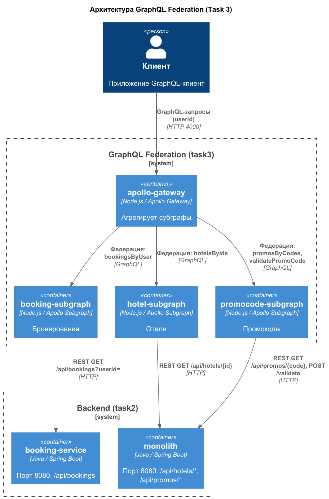

# Task 3 - отчёт о проделанной работе

## Что сделано

Реализован федеративный GraphQL API на базе **Apollo Federation v2**, состоящий из трёх субграфов и одного шлюза. Все субграфы выполняют реальные вызовы в существующие сервисы (monolith и booking-service), что обеспечивает актуальность данных и корректную работу ACL.

## Архитектура

                        ┌─────────────────────┐
                        │   apollo-gateway    │  :4000
                        └──────────┬──────────┘
                 ┌─────────────────┼─────────────────┐
                 │                 │                 │
        ┌────────▼────────┐ ┌─────▼──────────┐ ┌─────▼─────────────┐
        │ booking-subgraph│ │ hotel-subgraph │ │ promocode-subgraph│
        │      :4001      │ │     :4002      │ │       :4003       │
        └────────┬────────┘ └────────┬───────┘ └─────────┬─────────┘
                 │                   │                   │
                 │        ┌──────────▼───────┐           │
                 │        │     monolith     │           │
                 │        │  /api/hotels/*   │◄──────────┘
                 │        │  /api/promos/*   │
                 │        └──────────────────┘
                 │
        ┌────────▼─────────┐
        │  booking-service │
        │  /api/bookings   │
        └──────────────────┘

## Изменения по компонентам

### 1. apollo-gateway
- В serviceList добавлены все три субграфа: booking, hotel, promocode.
- Реализован RemoteGraphQLDataSource с переопределением willSendRequest: заголовок **userid** с клиента копируется в запросы ко всем субграфам (необходимо для корректной работы ACL на стороне booking-subgraph и promocode-subgraph).

### 2. booking-subgraph

- Тип Booking @key(fields: "id") с полями: id, userId, hotelId, promoCode, discountPercent, hotel.
- **Получение данных**: запрос bookingsByUser выполняет REST-вызов GET http://booking-service:8080/api/bookings?userId={id} в booking-service.
- **ACL**: проверяется заголовок userid из запроса. Если он отсутствует - ошибка No user info in the Header.; если не совпадает с запрошенным userId - Wrong user info.
- Поле hotel возвращает ссылку { id: booking.hotelId }, которую шлюз резолвит через hotel-subgraph (федерация).
- __resolveReference для загрузки бронирования по id через GET /api/bookings/{id}.

### 3. hotel-subgraph

- Тип Hotel @key(fields: "id") с полями: id, name, city, stars.
- **Получение данных**: загрузка отеля через REST-вызов GET http://monolith:8080/api/hotels/{id} в монолит.
- **Кеширование**: in-memory кеш node-cache с TTL 300 секунд и интервалом очистки 60 секунд - повторные запросы к одному отелю не нагружают монолит.
- Сделан **маппинг полей**: name <- description (или name), stars <- Math.round(rating).
- __resolveReference и запрос hotelsByIds используют общую функцию getHotelById с кешированием.

### 4. promocode-subgraph

- **Новый сервис** на порту **4003**.
- Сделан **@override(from: "booking")** на поле discountPercent и теперь расчёт скидки выполняется в субграфе promocode, а не в booking.
- Добавлен тип **DiscountInfo** с полями: isValid, originalDiscount, finalDiscount, description, expiresAt.
- **Получение данных**: загрузка промокода через REST-вызов GET http://monolith:8080/api/promos/{code} в монолит.
- **Кеширование**: node-cache с TTL 300 секунд.
- Запросы: promosByCodes(codes), validatePromoCode(code, userId) (POST http://monolith:8080/api/promos/validate).

### 5. docker-compose

- Сервис promocode-subgraph добавлен в общий docker-compose-файл.
- Используется та же **внешняя сеть hotelio-net**, что и в task2. Это обеспечивает связность с монолитом и booking-service.
- Для выполнения запросов GraphQL можно использовать веб утилиту, запущеную на адраесах: http://localhost:4000 (gateway), http://localhost:4001 (booking), http://localhost:4002 (hotel), http://localhost:4003 (promocode).

### 6. Новые тесты
В каталоге **/test-new** находятся регрессионные тесты, созданные на базе исходных тестов, адаптированные под разделение монолита и расширенный для Apollo Gateway. 

## Особенности реализации

1. Все субграфы выполняют реальные вызовы в monolith и booking-service. Это гарантирует актуальность данных и корректную работу ACL.
2. **Два docker-compose файла** - для запуска полного окружения необходимо поднять оба:
   - tasks/task2/docker-compose.yml для monlith, booking-service, Kafka и баз данных;
   - tasks/task3/docker-compose.yml для GraphQL-шлюза и субграфов.

## Как запускать

Через ***bash или Terminal в VSCode*** 
### 1. Поднять через docker compose инфраструктуру из task2 (monolith, booking-service, Kafka, базы данных)
cd tasks/task2
docker compose up -d --build

### 2. Поднять через docker compose GraphQL-шлюз и субграфы из task3
cd ../task3
docker compose up -d --build

## Тестирование

### Запуск регрессионных тестов

В bash или Terminal в VSCode
# Из корня проекта
./run_regress_tests_new.bat

### Результаты

Все тесты успешно пройдены (см. test-log.txt):

## Артефакты в results:

| Файл           | Назначение |
|----------------|------------|
| docker_ps.txt  | вывод docker ps после успешного запуска всех контейнеров |
| test-log.txt   | лог выполнения регрессионных тестов (REST + GraphQL) |

## Что отложенно на будущее

Решение проблемы N+1 в сабграфе отелей и промокодов было сделано через кеширование. В сущности это не полноценное решение проблемы N+1, а компенсация последствий. Для полноценного решения проблемы нужно добавить в код монолита методы получения отелей и промокодов по списку идентификаторов и вызывать их, а не одиночные методы.

Для реалзации данного решения также потребуется сделать pagination или chuncking, так как при большом количестве данных нужно будет иметь возможность получать данные пачками, а не сразу все. 